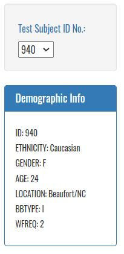
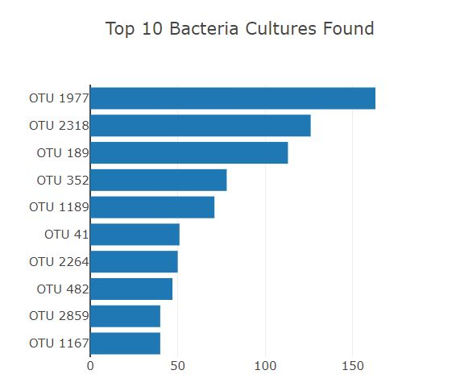
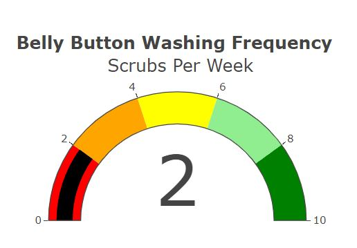
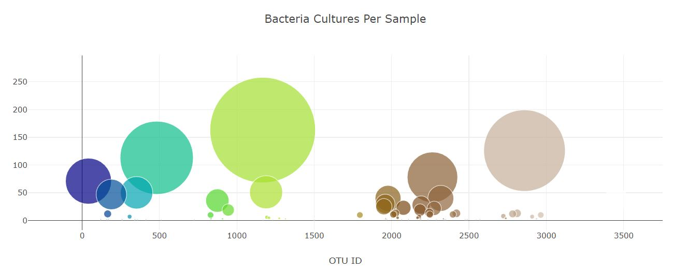

## Overview 
---

Searching for a new bacteria that synthesizes proteins that taste like beef; we have partnered with "Improbable Beef", a food start-up to research the next best bacterial species to provide the perfect beef taste. Hypothesizing that the next microorganism that will be the key bacteria we are searching for is found on the human body, we have collected samples from individuals across the country the country. This dashboard was created so that participants can review the bacterial species colonizing their belly buttons in an anonymous fashion by using the ID number given to them at the time of sample collection.

To view this site [Click Here](https://austenmarden.github.io/Belly_Button_Biodiversity/).

### Tools used
    - HTML
        - Bootstrap
        - CSS formating
    - Javascript
        - D3
        - Plotly

## How To Look Up Your Belly Button
---

-   To look at your sample results, select your ID number on thr dropdown to the left of the page. 

    

-   Immediately, you'll see that the table of personal data and the various grapical components update you display your personal results.

    -   Bar Graph:

    

    -   Gauge:

    

    -   Bubble Graph:

    

